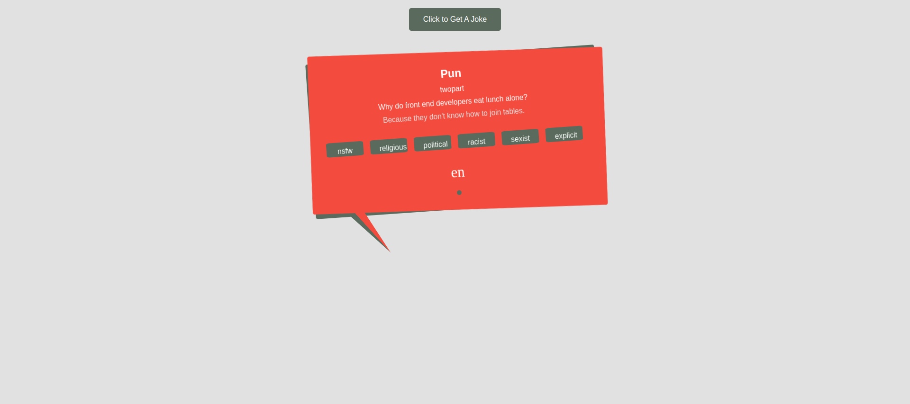

# Get A Joke

> A simple website allows the user to generate a joke.

## Table of contents

- [Get A Joke](#get-a-joke)
  - [Table of contents](#table-of-contents)
  - [General info](#general-info)
  - [Screenshots](#screenshots)
  - [Technologies](#technologies)
  - [Setup](#setup)
  - [Code Examples](#code-examples)
  - [Features](#features)
  - [Status](#status)

## General info

> The objective of the project is to practice using get requests and apply
> separation of concerns.

## Screenshots



## Technologies

- JavaScript
- HTML5
- CSS3
- VSC code

## Setup

- clone the repo.
- `npm install`

## Code Examples

```js
const getJoke = async () => {
	const url = 'https://v2.jokeapi.dev/joke/Any';
	try {
		const res = await fetch(url);
		if (!res.ok) {
			throw new Error(`Failed to fetch a joke with status : ${res.status} `);
		}

		return await res.json();
	} catch (err) {
		console.error(err);
	}
};

export default getJoke;
```

## Features

List of features ready and Todos for future development

- Joke Button Generation: The main feature of the website. Users can click a
  button to generate a random joke. Jokes could be categorized into different
  types such as puns, dark, programming, misc, etc.
- Random Joke API: Integration of a third-party joke API to provide a wider
  variety of jokes and ensure freshness.

To-do list:

- Start by defining the HTML structure for joke container.
- Style the joke container using CSS.
- Separating concerns in this way, to have a clear structure, making code easier
  to understand, maintain, and expand upon. It's a great approach for building
  scalable and maintainable page

## Status

Project is: _Completed_
